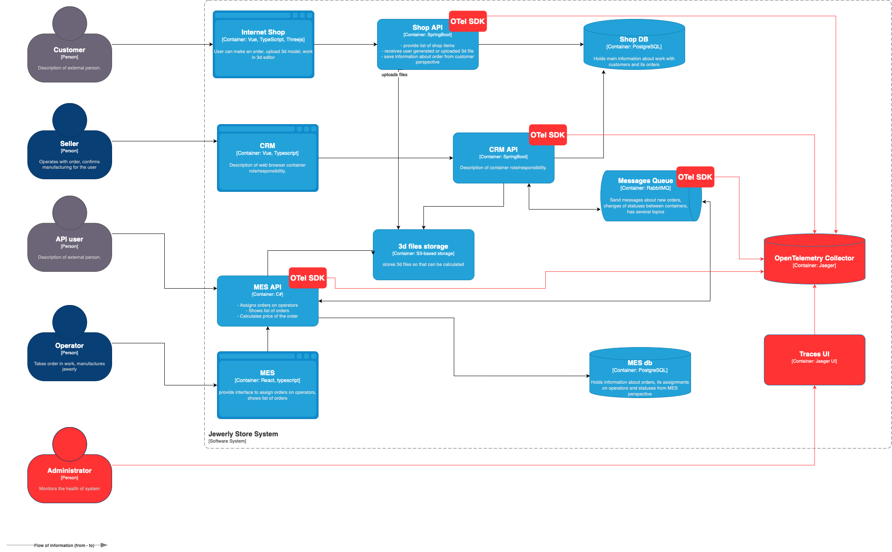

# Архитектурное решение по трейсингу

## Планирование трейсинга

Причины, по которым заказ может "потеряться" или "зависнуть", сгруппированные по сервисам:
- Интернет-магазин:
  - некорректная обработка созданного заказа в Shop API;
  - неправильное или неуспешное сохранение данных заказа в Shop DB;
  - непрошедшая оплата, из-за чего заказ не продвигается дальше по статусу.
- MES:
  - отсутствие нового заказа в списке заказов при получении из очереди;
  - некорректное присвоение заказа оператору;
  - отсутствие уведомлений о новом заказе.
- CRM:
  - некорректная смена статуса заказа;
  - некорректная обработка данных о заказе от MES API;
  - неправильное или неуспешное сохранение данных заказа в Shop DB.
- RabbitMQ:
  - истечение времени жизни сообщений, из-за чего они удаляются, не достигнув цели;
  - неверные наименования топиков.

Данные, которые пригодятся в трейсинге:
- trace_id - идентификатор текущей операции;
- span_id - идентификатор подзапроса;
- duration - длительность подзапроса;
- url_path - эндпоинт;
- code - код результата;
- node_id - идентификатор ноды приложения;
- environment - окружение развертывания.

## Мотивация

Трейсинг позволит эффективно выявлять "узкие места" в разных сценариях, экономя время и силы разработчиков. В результате поиск проблем значительно ускорится, а задача бизнеса — решить проблему клиента, и как можно скорее, что поспособствует сохранению клиентов.

Итого, трейсинг повлияет на следующие метрики:
- увеличится скорость решения проблем клиентов;
- увеличится доля успешных операций, таких как создание и выполнение заказа;
- повысится скорость отклика системы (выполнения запросов) благодаря оптимизации медленных подзапросов;
- уменьшатся затраты ресурсов разработчиков на расследование инцидентов, что позволит им заниматься новыми фичами, соответственно, будет быстрее развиваться продукт.

## Предлагаемое решение

Для реализации трейсинга в системе можно использовать компоненты, поддерживающие OpenTelemetry, который является отраслевым стандартом (большинство SDK и фреймворков умеют с ним работать).

- OpenTelemetry SDK, Instrumentation, Exporter - компоненты на стороне приложений, которые позволят собирать и экспортировать трейсы.
- Jaeger (OpenTelemetry Collector) - хранилище, собирающее трейсы со всех приложений.
- Jaeger UI - веб-интерфейс для поиска и просмотров трейсов.

[Ссылка на схему в формате .drawio](./jewerly_c4_model_traces.drawio)

## Компромиссы

Трейсинг требует ресурсы на поддержку дополнительных сервисов, поэтому он может быть нецелесообразен в следующих случаях:
- проект находится в стадии MVP;
- сценарии предполагают ограниченное взаимодействие компонентов системы;
- система взаимодействует со множеством внешних систем, тогда внедрение трейсинга может не давать полную картину (но зависит от случая - внешние системы могут быть готовы предоставлять трейсы);
- приложения написаны на устаревших технологиях, для которых не разработан OTel SDK, тогда переписывание на новые технологии может быть дорогостоящим;
- у продукта высокие требования к конфиденциальности.

## Безопасность

Доступ к трейсам должен быть только авторизованным - в контуре компании должен быть настроен строгий ACL, запрещающий по умолчанию доступ к объектам для всех сотрудников, а разрешающий только для определенной группы. Сервер с трейсами должен находиться за firewall, чтобы отсекать лишние попытки подключения. Трафик должен шифроваться, например, при подключении к Jaeger UI должен быть включен протокол HTTPS и запрещен HTTP. Если это невозможно, то можно использовать sidecar proxy.
