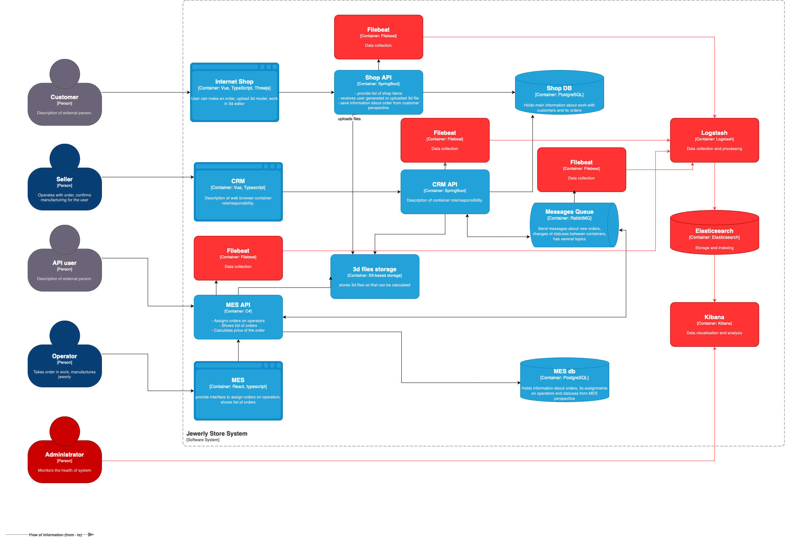

# Архитектурное решение по логированию

## Планирование логирования

Логи с уровнем INFO (по умолчанию во всех логах включено поле timestamp):
- Интернет-магазин:
  - Создание заказа - user_id, order_id
  - Оплата заказа - user_id, order_id, payment: { type, status }
  - Загрузка файла с 3d-моделью изделия - order_id, file_data: { name, size }
- MES:
  - Расчет стоимости изделия - order_id, duration, complexity, amount
  - Начало выполнения заказа - order_id, operator_id
  - Завершение выполнения заказа - order_id, operator_id, comment
  - Начало подготовки заказа к отправке - order_id, executor_id
  - Отправка заказа покупателю - order_id, track_number
- CRM:
  - Готовность к выполнению заказа - order_id
  - Закрытие заказа - order_id, status, comment

Помимо уровня INFO потребуются уровни ERROR (во всех окружениях), WARN и DEBUG (в release и dev окружениях, можно добавить флаг включения этих уровней). Также можно добавить уровень FATAL для обозначения критических проблем, на которые незамедлительно нужно отреагировать.

## Мотивация

Добавление логирования позволит:
- анализировать поведение системы в разных сценариях;
- сократить время на поиск причины проблемы;
- обнаруживать проблему до того, как о ней узнает клиент;
- отслеживать подозрительные действия пользователей;
- обнаруживать аномалии.

Приоритизация настройки логирования и трейсинга по системам:
1. CRM и MES - ядро обработки заказов, поэтому потенциально эти системы могут влечь к проблемам с заказами.
2. Очередь сообщений RabbitMQ - как показывает практика, проблемы часто возникают с очередью, и это трудно отлавливать.
3. Интернет-магазин - точка входа для заказов со стороны клиентов.

Логирование необходимо внедрить для главных компонентов системы, а трейсинг стоит внедрить как минимум для потока обработки заказа.

## Предлагаемое решение

Предлагается использовать ELK-стек для внедрения логирования в систему. Для этого необходимо встроить на сервера агент Filebeat, который отправляет логи в хранилище. Перед сохранением в хранилище логи будут обрабатываться в Logstash, а затем помещаться в Elasticsearch. Для визуализации логов будет использоваться Kibana.

По мере заполнения диска или по истечении некоторого времени (например, 3 месяца) логи будут удаляться. Можно организовать хранение на разных типах носителей c разным сроком, например, "горячие" данные хранить на SSD, а "холодные" - на HDD. Индексы можно создать либо под отдельные компоненты, либо под регионы. Размер логов зависит от бюджета и скорости заполнения диска.

Для организации безопасности требуется установка строгого ACL на объекты и аутентификация пользователя - по умолчанию для всех должен быть выставлен запрет на просмотр, а для определенной группы - разрешен. Сервер с логами должен находиться за firewall, а трафик - шифроваться. Для снижения риска утечек чувствительных данных логи должны проходить обработку по вырезанию чувствительных частей, таких как пароли, банковские данные и тд.

[Ссылка на схему в формате .drawio](./jewerly_c4_model_logging.drawio)

## Превращение системы сбора логов в систему анализа логов

Алертинг необходимо настроить для того, чтобы не пропускать критичные ошибки системы и возможные угрозы атаки. Оповещения можно отправлять при появлении логов уровня FATAL или при обнаружении аномалий. Для обнаружения аномалий можно использовать функциональность Anomaly Detection на основе ML, встроенную в Elastic. Аномалии могут быть как технические (такие как множественные таймауты сервиса), так и внешние (такие как DDoS-атака или множественные неудачные попытки входа в систему).

Возможные шаги:
- настроить дашборды в Kibana для анализа логов;
- настроить Anomaly detection для поиска аномалий;
- настроить оповещения о событиях, требующих внимания, по почте или в корпоративном мессенджере.
