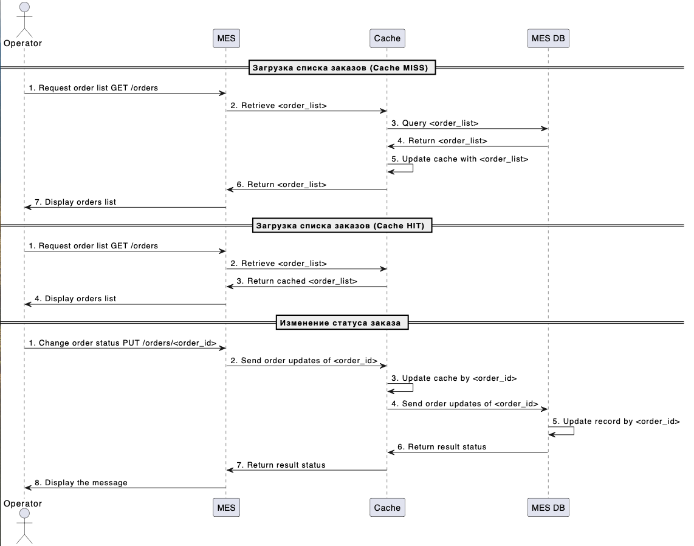

# Архитектурное решение по кешированию

## Мотивация

Кеширование улучшает отзывчивость пользовательского интерфейса, уменьшая нагрузку на базу данных или удалённые сервисы. Определить точно, какие части системы стоит закешировать, можно только после проведения анализа полученных метрик после внедрения мониторинга. Но потенциально кеширование может потребоваться в следующих частях:
- MES API - загрузка первой страницы, получение списка заказов;
- MES API - расчёт стоимости изделия (не пересчитывать стоимость заново при отправке той же 3D модели).

## Предлагаемое решение

### Выбор подхода к кешированию

За основу предлагается взять серверное кеширование, потому что проблема в медленной работе MES API, которым пользуются не только внутри компании с помощью MES-интерфейса, но и извне.

Для списка заказов предлагается использовать сочетание паттернов Read-Through и Write-Through, так как главная особенность этих паттернов - консистентность данных, что в данном случае имеет определяющее значение, так как операторам важно получать самые свежие данные о новых заказах. Также данные паттерны имеют относительно низкую стоимость. Паттерн Cache-Aside не подходит потому, что он может привести к неконсистентности данных. Паттерн Refresh-Ahead может привести к временной рассинхронизации, поэтому тоже не подходит. Паттерн Write-Behind может подойти, но тогда нужен более тщательный мониторинг, иначе можно натолкнуться на неконсистентность данных.

Для расчета стоимости изделия подойдет только паттерн Cache-Aside, так как эта операция не подразумевает взаимодействие с БД.

### Диаграмма последовательности

Ниже приведена диаграмма последовательности для следующих сценариев:
- Чтение списка заказов при отсутствии кеша (при прогреве);
- Чтение списка заказов из кеша;
- Изменение статуса заказа.

### Инвалидация кеша

Для инвалидации кеша предлагается использовать инвалидацию на основе изменений, так как она обеспечивает актуальность данных. Например, при добавлении нового заказа система инвалидирует кеш списка заказов. Так пользователи смогут видеть актуальные данные, даже если другие пользователи вносят изменения.

Программная и инвалидация по ключу тоже подходят, но требуют больших затрат на реализацию. Временная инвалидация не подходит, так как она может привести к устареванию данных. Инвалидация на основе запросов не подходит, потому что может создать избыточную нагрузку.
